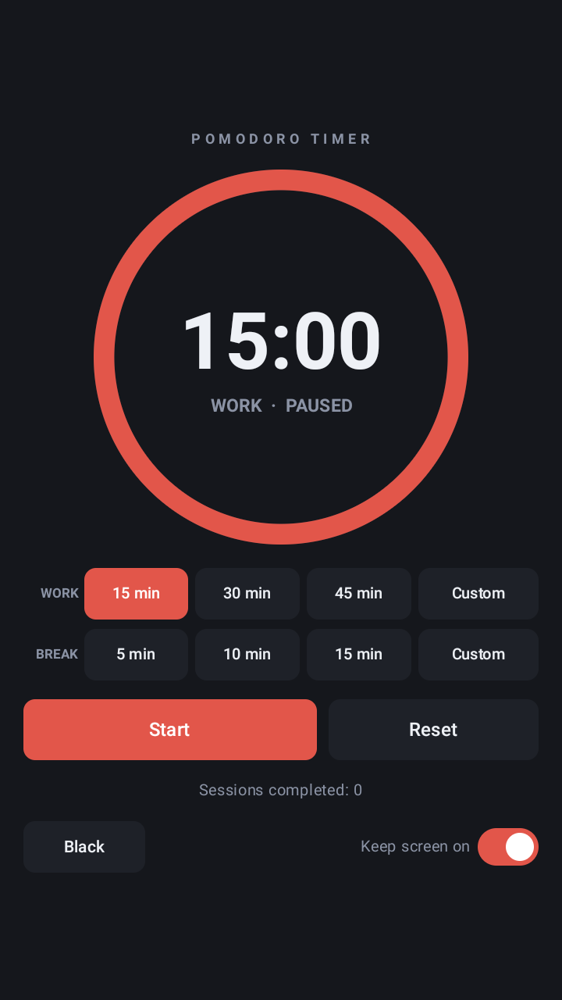
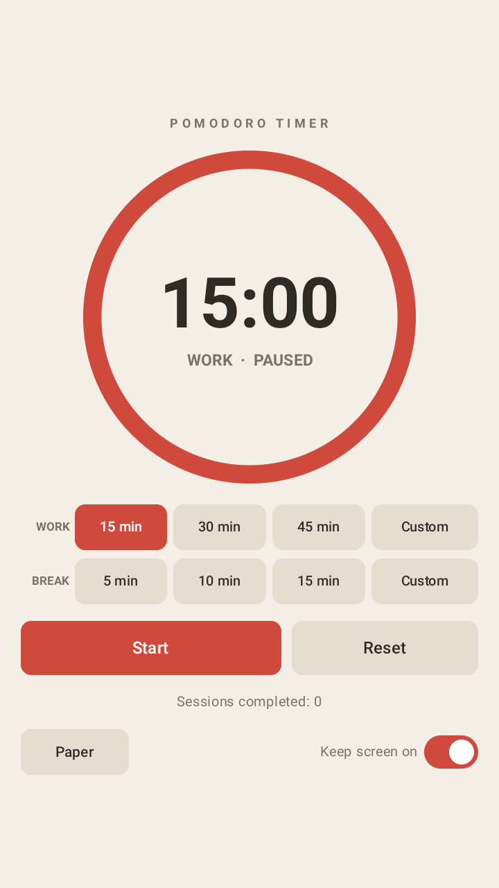
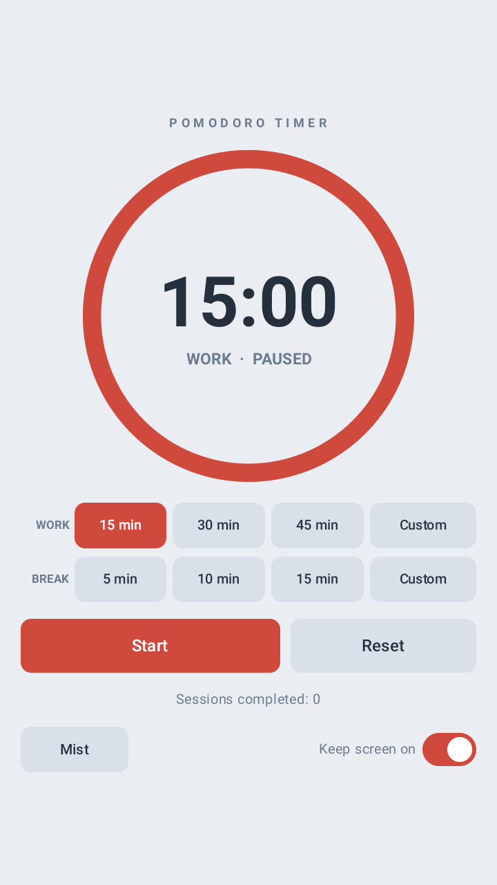
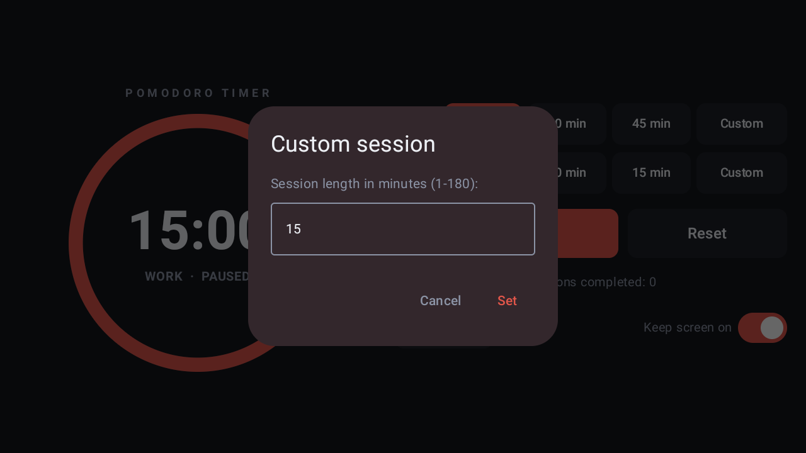

# Pomodoro Timer

A Pomodoro focus timer for Android that works **entirely offline**. No ads, no
analytics, no accounts — and no `INTERNET` permission at all, so it has no means
of sending anything anywhere.

[**⬇ Download the latest APK**](https://github.com/Micheal-Jiaming/Pomodoro-timer-Android/releases/latest)
· Requires Android 8.0 (API 26) or newer · [Apache-2.0](LICENSE)

<table>
  <tr>
    <td align="center"><br><sub><b>Black</b></sub></td>
    <td align="center"><br><sub><b>Paper</b></sub></td>
    <td align="center"><br><sub><b>Mist</b></sub></td>
    <td align="center"><br><sub><b>Custom session</b></sub></td>
  </tr>
</table>

## What it does

Choose how long to work, start it, and take a break when it ends.

The countdown is driven by a **deadline rather than by counting ticks**, so it
cannot drift, and an **exact alarm** means a finished session announces itself
even if Android has shut the app down in the meantime. Reopen it and the usual
end-of-session prompt is waiting.

- Work presets of 15, 30 and 45 minutes; break presets of 5, 10 and 15
- Any custom length from 1 to 180 minutes
- A depleting ring showing the time remaining, sized to your screen
- A completed-session count that survives the app being closed
- Three themes: Black, Paper and Mist
- A live countdown in the notification shade
- An optional "keep screen on" switch
- A layout that adapts to tall screens and to wide or short ones

## Privacy

The app declares no `INTERNET` permission. That is not a promise about how it
behaves — it is a limit Android enforces on it: without that permission the
process cannot open a network connection at all. The only things it remembers,
your chosen theme and your session count, stay on your device.

## Installing

### From my F-Droid repository

The app is also published from its own small F-Droid repository, which gives you
the ordinary store experience: a listing with a description, and updates offered
to you instead of hunted down.

1. Install [F-Droid](https://f-droid.org/) if you do not already have it.
2. Open **Settings → Repositories**, tap **+**, and add this address:

```
https://micheal-jiaming.github.io/Pomodoro-timer-Android/fdroid/repo?fingerprint=8403BEEFFFB9AD148C5E428FC951D84E48DA9DE7ACB6DB3E5C1DE6158DD69DAC
```

3. Refresh, search for **Pomodoro Timer**, and install.

Keep the `fingerprint` on the end. It is not decoration — the client pins the
repository's signing key to it, so a repository served from a hijacked address
would be rejected rather than quietly trusted.

This repository serves the same APK, signed with the same key, as the Releases
page above, so you can switch between the two freely.

### By downloading the APK directly

Download the APK from [Releases](https://github.com/Micheal-Jiaming/Pomodoro-timer-Android/releases/latest)
and open it on your phone. Android will ask you to allow installing apps from
this source, because it did not come from a store.

> **A note on signatures.** These APKs are signed with the developer's own key.
> If this app is later accepted into F-Droid's main repository, F-Droid rebuilds
> and signs it with *their* key, and Android refuses to update across a change
> of signing key — you would have to uninstall this build first. Worth knowing
> before you pick a source to install from.

## Building from source

You need JDK 17 and an Android SDK with API 34. The Gradle wrapper fetches
Gradle itself.

```bash
./gradlew assembleDebug
```

The APK lands in `app/build/outputs/apk/debug/`.

A **release** build additionally needs signing credentials — `RELEASE_STORE_FILE`,
`RELEASE_STORE_PASSWORD`, `RELEASE_KEY_ALIAS` and `RELEASE_KEY_PASSWORD` in
`local.properties`, which is deliberately not in this repository. Without them
the build still succeeds but produces `app-release-unsigned.apk`, which is not
installable as-is. That fallback is intentional: it is what lets a fresh clone,
and F-Droid's build server, build the project without holding the signing key.

## Documentation

[`Pomodoro timer Android.md`](Pomodoro%20timer%20Android.md) is the full project
document — architecture, per-feature reasoning, the publishing route, and an
honest account of what has and has not been verified. Start there rather than
here if you intend to work on the code.

## Licence

[Apache License 2.0](LICENSE) — Copyright 2026 Micheal-Jiaming.
